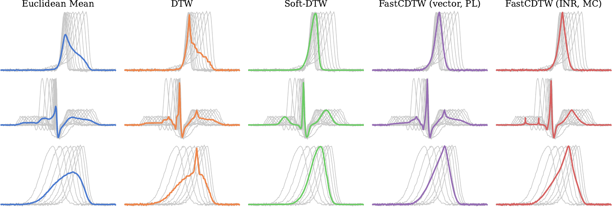

# FastCDTW

Code for *Fast Gradient-Based Approximation of Continuous Dynamic Time Warping*.
FastCDTW computes Continuous DTW (CDTW) [1], the continuous-time counterpart of DTW [2], by gradient descent on a parametrized warping function.
The cost of a warping is computed in closed form for piecewise-linear (PL) warpings, or by an unbiased Monte Carlo (MC) estimate for smooth ones such as implicit neural representations [3]; both give gradients with respect to the warping and the series, and run batched on GPU.
`fastcdtw/` is the library; `experiments/averaging/` allows to re-run the experiments from the article.



*Figure 3 of the paper: barycenters of `accel` (top), `ecg` (middle) and `rate` (bottom). Grey: the averaged series.*

## References

1. K. Buchin, A. Nusser, S. Wong. Computing continuous dynamic time warping of time series in polynomial time. *Journal of Computational Geometry*, 2025.
2. H. Sakoe, S. Chiba. Dynamic programming algorithm optimization for spoken word recognition. *IEEE Trans. Acoustics, Speech, and Signal Processing*, 1978.
3. E. Le Naour et al. Time series continuous modeling for imputation and forecasting with implicit neural representations. *TMLR*, 2024.

## Citation

```bibtex
@misc{houedry2026fastcdtw,
  title  = {Fast Gradient-Based Approximation of Continuous Dynamic Time Warping},
  author = {Houedry, Pierre and Tavenard, Romain and Courty, Nicolas and Gaudel, Romaric},
  year   = {2026}
}
```
